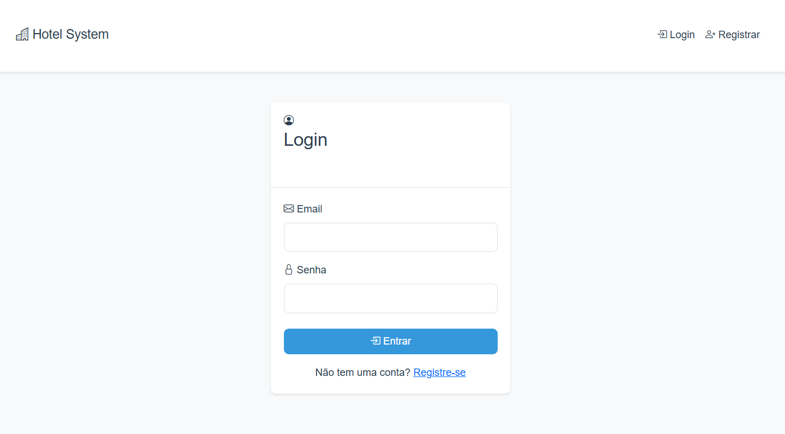

<div align="center">
  
  
  # 🏨 Sistema de Reservas de Hotel
  
  [](https://www.python.org)
  [](https://flask.palletsprojects.com/)
  [](https://getbootstrap.com/)
  [](LICENSE)
  [](http://makeapullrequest.com)
  
</div>

---

## 📋 Sumário

- [Sobre o Projeto](#-sobre-o-projeto)
- [Funcionalidades](#-funcionalidades)
- [Tecnologias](#-tecnologias-utilizadas)
- [Começando](#-começando)
- [Instalação](#-instalação)
- [Configuração](#-configuração)
- [Uso](#-uso)
- [Roadmap](#-roadmap)
- [Contribuindo](#-contribuindo)
- [Licença](#-licença)
- [Contato](#-contato)

## 🎯 Sobre o Projeto

O Simples Sistema de Reservas de Hotel é uma solução básica para melhora e aprimoramento de código, oferecendo uma interface moderna e intuitiva tanto para clientes quanto para administradores. Desenvolvido com as melhores práticas de programação e design responsivo, o sistema proporciona uma experiência fluida em qualquer dispositivo.

### 💡 Principais Diferenciais

- Interface moderna e intuitiva
- Design totalmente responsivo
- Sistema de reservas em tempo real
- Gestão de quartos e reservas simples
- Painel administrativo
- Sistema de autenticação seguro

## ✨ Funcionalidades

### 👥 Área do Cliente
- Visualização de quartos disponíveis e descrições
- Reservas online
- Gerenciamento de reservas pessoais
- Histórico de estadias

### 👨‍💼 Área do Administrador
- Gerenciamento simples de quartos
  - Adicionar/Editar/Remover quartos
  - Definição de preços e tipos
- Controle de reservas
  - Visualização de todas as reservas
  - Confirmação/Cancelamento de reservas
  - Histórico detalhado
- Dashboard administrativo
  - Estatísticas de ocupação
  - Relatórios de reservas

## 🛠 Tecnologias Utilizadas

- **Backend**
  - Python 3.8+
  - Flask (Framework Web)
  - SQLAlchemy (ORM)
  - Flask-Login (Autenticação)
  - Werkzeug (Utilitários)

- **Frontend**
  - HTML5
  - CSS3 (Design Responsivo)
  - JavaScript
  - Bootstrap 5
  - Font Awesome (Ícones)

- **Banco de Dados**
  - SQLite (Desenvolvimento)
  - PostgreSQL (Produção)

## 📋 Pré-requisitos

- Python 3.8 ou superior
- pip (Gerenciador de pacotes Python)
- Virtualenv (recomendado)

## 🚀 Instalação

1. Clone o repositório
```bash
git clone https://github.com/biaphra/sistema-reservas-hotel.git
cd sistema-reservas-hotel
```

2. Crie e ative um ambiente virtual
```bash
python -m venv venv
source venv/bin/activate  # Linux/Mac
venv\Scripts\activate     # Windows
```

3. Instale as dependências
```bash
pip install -r requirements.txt
```

4. Configure as variáveis de ambiente
```bash
cp .env.example .env
# Edite o arquivo .env com suas configurações
```

5. Inicialize o banco de dados
```bash
python reset_db.py
```

6. Execute o servidor de desenvolvimento
```bash
python app.py
```

## 📝 Configuração

O sistema pode ser configurado através das seguintes variáveis de ambiente:

- `FLASK_ENV`: Ambiente de execução (development/production)
- `SECRET_KEY`: Chave secreta para sessões
- `DATABASE_URL`: URL de conexão com o banco de dados
- `UPLOAD_FOLDER`: Diretório para upload de imagens

## 🔒 Segurança

- Senhas criptografadas com Werkzeug
- Proteção contra CSRF
- Validação de entrada de dados
- Controle de acesso baseado em funções
- Sanitização de uploads de arquivos

## 📱 Responsividade

O sistema é totalmente responsivo, adaptando-se a diferentes tamanhos de tela:
- Desktop
- Tablet
- Smartphone

## 🎨 Personalização

O sistema utiliza variáveis CSS para fácil personalização:
- Cores principais
- Tipografia
- Espaçamentos
- Elementos visuais

## 📊 Estrutura do Projeto

```
sistema-reservas-hotel/
├── app.py              # Aplicação principal
├── config.py           # Configurações
├── models/             # Modelos do banco de dados
├── static/             # Arquivos estáticos
│   ├── css/
│   ├── js/
│   └── uploads/
├── templates/          # Templates HTML
│   ├── admin/
│   └── client/
└── utils/             # Utilitários
```

## 🤝 Contribuindo

1. Faça um Fork do projeto
2. Crie uma branch para sua feature (`git checkout -b feature/AmazingFeature`)
3. Commit suas mudanças (`git commit -m 'Add some AmazingFeature'`)
4. Push para a branch (`git push origin feature/AmazingFeature`)
5. Abra um Pull Request

## 📄 Licença

Este projeto está sob a licença MIT. Veja o arquivo [LICENSE](LICENSE) para mais detalhes.

## 👥 Autores

- **Biaphra Araujo** - *Trabalho inicial* - [SeuUsuario](https://github.com/biaphra)

## 🙏 Agradecimentos

- Bootstrap Team
- Flask Team
- Todos os contribuidores que participaram deste projeto

---
⌨️ By: [Seu Nome](https://github.com/biaphra) 😊
